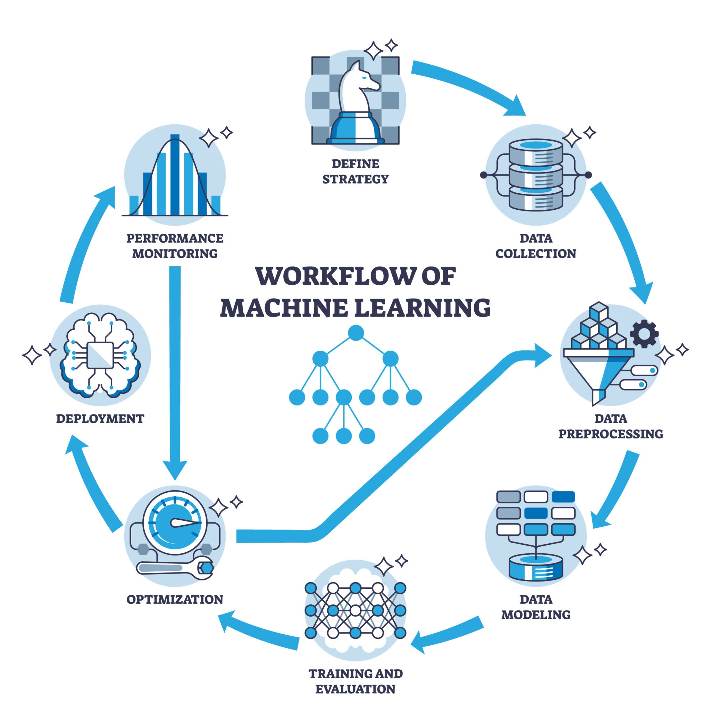

# DualPath-MedAI

**L'Intelligenza Artificiale al servizio della Ricerca Farmaceutica.**

- **Sviluppatori:** Fabio D'alessandro, Maria Visone, Veronica Veneroso, Valerio Caria
- **Corso:** Python e Machine Learning

---

<h2>
Pipeline
</h2>

  

---

## Il Problema del Mercato

Sviluppare un nuovo farmaco richiede in media oltre 10 anni e investimenti miliardari.

Il collo di bottiglia principale? Il fallimento clinico tardivo.
Scoprire effetti collaterali imprevisti o meccanismi d'azione inefficaci durante le fasi avanzate brucia capitale, rallenta il time-to-market e mette a rischio i pazienti.

---

## La Nostra Soluzione

DualPath-MedAI è un Decision Support System (DSS) predittivo.

Offriamo alle aziende farmaceutiche uno strumento per simulare l'efficacia molecolare e prevedere i rischi clinici interamente in-silico, prima di avviare costosi trial fisici.

Un approccio a doppio binario per abbattere i costi di Ricerca e Sviluppo.

---

## La Tecnologia: Motore a Doppio Binario

Il nostro vantaggio competitivo risiede nell'unione di due domini tecnologici in un'unica piattaforma integrata:

1. **Motore Biologico (Deep Learning):** Analizza l'espressione genica per prevedere l'esatto meccanismo d'azione della molecola.
2. **Motore Clinico (NLP):** Elabora la letteratura medica tramite Natural Language Processing per mappare e anticipare oltre 1800 potenziali effetti collaterali.

---

## Il Valore per il Business

L'adozione di DualPath-MedAI genera un ritorno sull'investimento (ROI) immediato:

- **Abbattimento dei costi:** Riduzione drastica dei test in-vitro fallimentari.
- **Profilazione rapida del rischio:** Valutazione istantanea della tossicità clinica.
- **Scalabilità:** Un'architettura pronta per essere distribuita in Cloud (SaaS) e integrabile nei sistemi ERP delle case farmaceutiche.

---

## Roadmap e Prossimi Passi

Il Minimum Viable Product (MVP) è pienamente operativo e validato su dataset internazionali.

**Fase 2 (Scale-up):**

- Addestramento continuo tramite Real-World Data provenienti dai database ospedalieri.
- Rilascio di API proprietarie per l'integrazione con software di terze parti.

Siamo pronti a trasformare il modo in cui i farmaci arrivano sul mercato.
